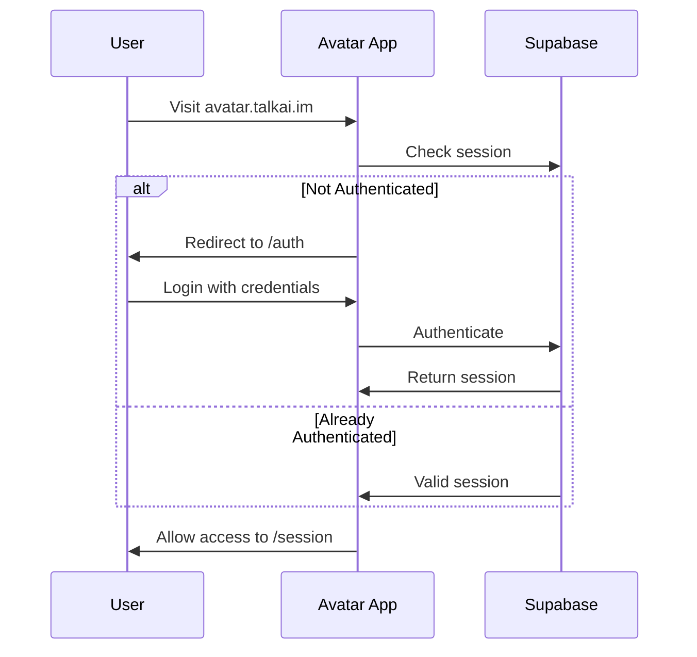

# Avatar App Integration with Existing TalkAI

This document explains how the Avatar app integrates with the existing TalkAI web application.

## Shared Resources

### 1. **Database (Supabase)**

The Avatar app uses the **same Supabase project** as the main TalkAI app.

#### Shared Tables:
- `profiles` - User profiles
- `chat_sessions` - Session records (with added `avatar_id` column)
- `chat_messages` - Chat transcript
- `emotion_metrics` - Emotion analysis data
- `subscriptions` - User subscription info

#### New Columns Added:
```sql
ALTER TABLE chat_sessions 
ADD COLUMN IF NOT EXISTS avatar_id TEXT,
ADD COLUMN IF NOT EXISTS duration_seconds INTEGER;
```

No new tables are created. The avatar app seamlessly extends existing schema.

### 2. **Authentication**

Users authenticate once and have access to both apps:
- Main app: `talkai.im`
- Avatar app: `avatar.talkai.im`

Both use Supabase Auth with shared session cookies.

**User Flow:**
1. User signs up on main TalkAI app
2. Profile created in `profiles` table
3. User can immediately access avatar app
4. No separate registration needed

### 3. **User Settings**

Settings are stored in the `profiles` table:
- `save_chat_history` - Whether to store conversations
- `voice_config_id` - Preferred voice configuration
- `subscription_tier` - Access level

The avatar app reads and respects these settings.

## Authentication Flow



## Data Flow

### Session Creation

```javascript
// Avatar app creates session
const { data: session } = await supabase
  .from('chat_sessions')
  .insert({
    user_id: user.id,
    title: 'Avatar Session',
    status: 'active',
    avatar_id: 'heygen_avatar_123',
    voice_config_id: 'hume_config_456'
  });
```

### Message Storage

```javascript
// Same structure as main app
const { data: message } = await supabase
  .from('chat_messages')
  .insert({
    chat_session_id: session.id,
    role: 'user',
    content: 'Hello',
    emotion_data: { joy: 0.8, calm: 0.6 }
  });
```

### Emotion Metrics

```javascript
// Real-time emotion tracking
const { data: metrics } = await supabase
  .from('emotion_metrics')
  .insert({
    session_id: session.id,
    emotion_type: 'joy',
    score: 0.85,
    timestamp: new Date().toISOString()
  });
```

## Differences from Main App

| Feature | Main TalkAI App | Avatar App |
|---------|----------------|------------|
| Interface | Text chat | Video avatar |
| Voice | Optional | Required |
| Emotion Display | Text-based | Visual (avatar expressions) |
| Video | None | HeyGen streaming |
| Latency | Instant | <1 second |
| Session Type | Chat | Voice-to-voice |

## Subscription Access

Both apps use the same subscription tiers:

```typescript
// Check subscription
const { data: subscription } = await supabase
  .from('subscriptions')
  .select('tier')
  .eq('user_id', user.id)
  .single();

// Free tier: 10 min/month avatar sessions
// Premium: Unlimited avatar sessions
```

## Cross-App Navigation

Users can switch between apps seamlessly:

```typescript
// Main app → Avatar app
<a href="https://avatar.talkai.im">
  Try Avatar Therapy
</a>

// Avatar app → Main app
<a href="https://talkai.im">
  Back to Text Chat
</a>
```

Session remains active across navigation.

## Session History

Both apps display combined session history:

```typescript
// Query all sessions (text + avatar)
const { data: sessions } = await supabase
  .from('chat_sessions')
  .select('*')
  .eq('user_id', user.id)
  .order('created_at', { ascending: false });

// Avatar sessions have avatar_id populated
const avatarSessions = sessions.filter(s => s.avatar_id);
const textSessions = sessions.filter(s => !s.avatar_id);
```

## Emotion Analytics

Emotion data from both apps can be viewed together:

```typescript
// Combined emotion metrics
const { data: emotions } = await supabase
  .from('emotion_metrics')
  .select('*, chat_sessions!inner(*)')
  .eq('chat_sessions.user_id', user.id);

// Aggregate by app type
const avatarEmotions = emotions.filter(e => 
  e.chat_sessions.avatar_id
);
const textEmotions = emotions.filter(e => 
  !e.chat_sessions.avatar_id
);
```

## Migration Notes

### Adding Avatar Access to Existing Users

No migration needed! Existing users automatically get access:

1. User logs into avatar.talkai.im
2. Supabase validates their session
3. Profile is already in database
4. User can start avatar sessions

### Database Changes

Minimal changes to existing schema:

```sql
-- Run this once in Supabase SQL editor
ALTER TABLE chat_sessions 
ADD COLUMN IF NOT EXISTS avatar_id TEXT,
ADD COLUMN IF NOT EXISTS duration_seconds INTEGER;

-- Create index for performance
CREATE INDEX IF NOT EXISTS idx_chat_sessions_avatar 
ON chat_sessions(avatar_id) 
WHERE avatar_id IS NOT NULL;
```

## API Compatibility

The avatar app uses its own API routes but can call main app APIs:

```typescript
// Call main app API from avatar app
const response = await fetch('https://talkai.im/api/user/profile', {
  headers: {
    'Authorization': `Bearer ${accessToken}`
  }
});
```

## Development Setup

### Running Both Apps Locally

```bash
# Terminal 1: Main TalkAI app
cd apps/english
npm run dev  # Port 3000

# Terminal 2: Avatar app
cd apps/avatar
npm run dev  # Port 3003
```

Both apps connect to same Supabase instance.

### Shared Environment Variables

Both apps need:
```env
NEXT_PUBLIC_SUPABASE_URL=same_url
NEXT_PUBLIC_SUPABASE_ANON_KEY=same_key
```

## Testing Integration

### Test Cross-App Flow

1. Sign up on main app (talkai.im)
2. Create a text chat session
3. Navigate to avatar.talkai.im
4. Verify automatic login
5. Start avatar session
6. Check both sessions appear in history
7. Verify emotion data combines correctly

### Test Data Consistency

```typescript
// Check session appears in both apps
const { data: sessions } = await supabase
  .from('chat_sessions')
  .select('*')
  .eq('user_id', testUserId);

expect(sessions).toContain(textSession);
expect(sessions).toContain(avatarSession);
```

## Security Considerations

- **Row Level Security**: Both apps use same RLS policies
- **API Keys**: Avatar app has separate keys (Hume, HeyGen)
- **Authentication**: Shared auth tokens, same session management
- **Data Access**: Users can only access their own data in both apps

## Future Enhancements

Potential cross-app features:

1. **Unified Dashboard**
   - View all sessions (text + avatar) in one place
   - Combined emotion analytics

2. **Session Switching**
   - Start in text, switch to avatar mid-session
   - Resume avatar session in text mode

3. **Shared Profiles**
   - Avatar appearance preferences
   - Voice preferences sync

4. **Combined Metrics**
   - Track progress across both modalities
   - Compare emotion patterns

---

The avatar app is designed as a **complementary experience** to the main TalkAI app, sharing data and authentication while offering a unique video-based interaction mode.

